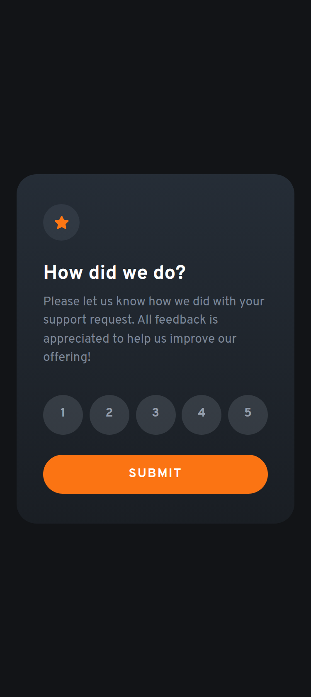
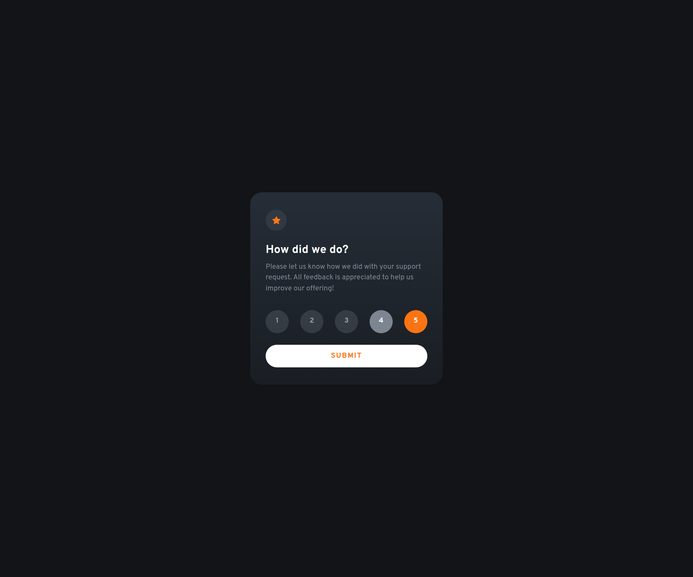

# Frontend Mentor - Interactive rating component solution

This is a solution to the [Interactive rating component challenge on Frontend Mentor](https://www.frontendmentor.io/challenges/interactive-rating-component-koxpeBUmI). Frontend Mentor challenges help you improve your coding skills by building realistic projects. 

## Table of contents

- [Overview](#overview)
  - [The challenge](#the-challenge)
  - [Screenshot](#screenshot)
  - [Links](#links)
- [My process](#my-process)
  - [Built with](#built-with)
  - [What I learned](#what-i-learned)
  - [Continued development](#continued-development)
  - [Useful resources](#useful-resources)
- [Author](#author)
- [Acknowledgments](#acknowledgments)

**Note: Delete this note and update the table of contents based on what sections you keep.**

## Overview

### The challenge

Users should be able to:

- View the optimal layout for the app depending on their device's screen size
- See hover states for all interactive elements on the page
- Select and submit a number rating
- See the "Thank you" card state after submitting a rating

### Screenshot

<figure>
  
  <figcaption style="margin: 0 0 50px 0; text-transform: capitalize">mobile screen - select rating card</figcaption>
</figure>

<figure>
  
  <figcaption style="margin: 0 0 50px 0; text-transform: capitalize">mobile screen - thank you card</figcaption>
</figure>

<figure>
  
  <figcaption style="margin: 0 0 50px 0; text-transform: capitalize">desktop screen - Select rating card</figcaption>
</figure>

<figure>
  
  <figcaption style="margin: 0 0 50px 0; text-transform: capitalize">desktop screen - thank you card</figcaption>
</figure>

<figure>
  
  <figcaption style="margin: 0 0 50px 0; text-transform: capitalize">hover states</figcaption>
</figure>

### Links

- Solution URL: [Github Repo](https://github.com/Deeokafor/fm-interactive-rating-component)
- Live Site URL: [Live Site](https://deeokafor.github.io/fm-interactive-rating-component/)

## My process

### Built with

- Semantic HTML5 markup
- CSS custom properties
- Flexbox
- Mobile-first workflow
- Ai Prompting
- [React](https://reactjs.org/) - JS library
- [Vite](https://vite.com/) - An efficient alternative to `create-react-app` for building React projects.

### What I learned

I decided to write this project in React.js. It wasn't an easy process but I saw myself going back to refresh on the fundamentals of css, js and new stuffs like react states and props.

### Continued development

Going forward, my focus areas will be react props and states. I need to have a consolidated understanding of how they work and how they affect the whole scope of a feature in building. Learning that props in react could be used with the spread operator `...props` almost made me go lazy with wanting to use it in all my props instances but discovering that it wasn't good practice put me in check. 

I also came across modern css selectors like `:has()` and `nesting`. These too, will have my focus shifted to them in future projects.

### Useful resources

- [React.dev](https://www.react.dev/learn) - This helped me a great deal with implementing the overall project in react. I got a good laugh when I learned that default components in react can be imported into other components with very unrelated names like `import { banana } from 'utils.js'` provided that "banana" in the utils.js file is exported as a default app. (lol)

- [w3Schools](https://www.w3schools.com/jsref/met_node_appendchild.asp) - I found hardcoding the ratings from 1 to 5 quite unnecessary, so I needed to know how to tell the program to do that for me with few instructions which led me to practising this.

- [www.freecodecamp.org](https://www.freecodecamp.org/news/what-is-box-sizing-border-box-css/) - My css became buggy along the line and this article from freecodecamp gave me some insight into crushing bugs the box-sizing way.

## Author

- Website - [Divine Okafor-udah](https://deedev.netlify.app/)
- Frontend Mentor - [@deeokafor](https://www.frontendmentor.io/profile/Deeokafor)
- Twitter - [@deeokafor](https://www.twitter.com/deeokafor)

## Acknowledgments

Thank you Copilot and Bing!!

